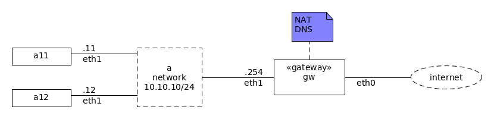

This is a [Vagrant](https://www.vagrantup.com/) Environment for a simple IP [NAT](https://en.wikipedia.org/wiki/Network_address_translation) gateway using [iptables](https://en.wikipedia.org/wiki/Iptables).

# Usage

Run `vagrant up` to configure the `gw.example.com` gateway that redirects requests from `a1.example.com` and `a2.example.com` to the internet.

To watch the traffic, run:

    vagrant ssh gw
    tcpdump -n -i eth1 not port ssh 

To generate some traffic, run:

    vagrant ssh a1
    ping ruilopes.com
